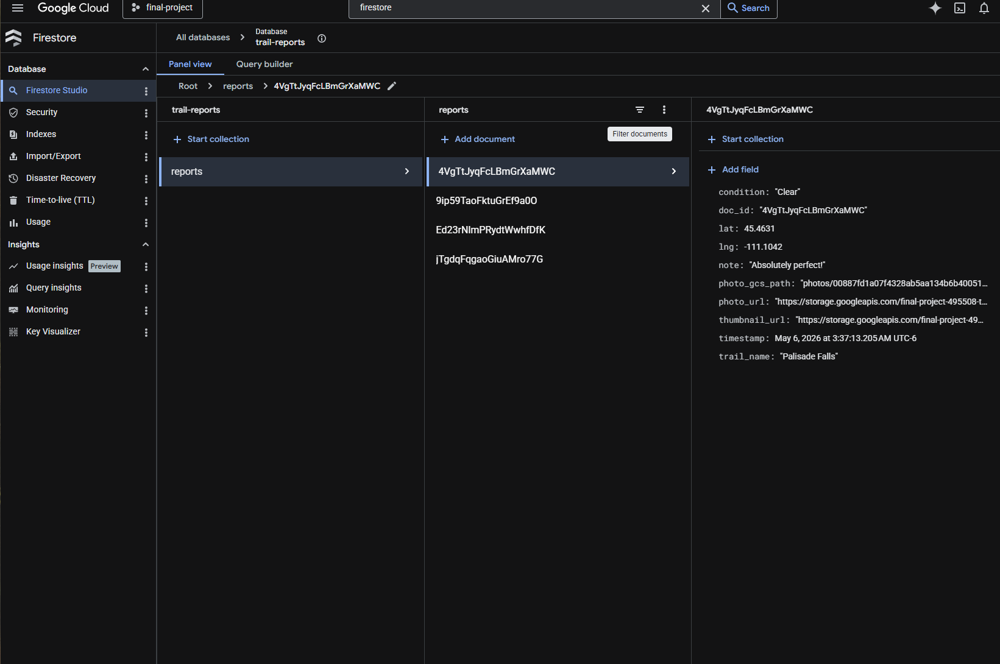

# Trail Conditions Tracker

A community-driven web application that lets hikers report and browse real-time trail conditions across Montana. Built on Google Cloud Platform.

## What It Does

Users visit the site, pick a trail from a list of popular Montana hikes, choose a condition status (Clear, Muddy, Snowy, Flooded, etc.), optionally attach a photo and a note, and submit. The report is saved to Firestore and shows up immediately on the main feed. If a photo was attached, a background function automatically generates a compressed thumbnail so the feed loads quickly.

## Architecture Overview

The application uses four distinct GCP services, each with a single responsibility:

| Layer | Service | Role |
|---|---|---|
| Compute | Cloud Run | Serves the Flask web app and REST API |
| Data/State | Firestore (Native mode) | Stores all trail report documents |
| Storage | Cloud Storage | Holds uploaded trail photos and generated thumbnails |
| Event/Background | Cloud Run Functions (2nd gen) | Triggered on photo upload to generate a 400px thumbnail |

### Data Flow

1. A user visits the Cloud Run web app and fills out the trail report form.
2. The Flask app uploads the photo (if any) to a Cloud Storage bucket under the `photos/` prefix, then writes the report metadata to Firestore.
3. The photo upload fires a `google.cloud.storage.object.v1.finalized` event, which triggers the Cloud Run Function.
4. The function downloads the original image, resizes it to 400px wide using Pillow, saves the thumbnail back to Cloud Storage under `thumbnails/`, and updates the Firestore document with the thumbnail URL.
5. Other users loading the trail feed read from Firestore. Photos and thumbnails are served directly from Cloud Storage's public URLs.

### Architecture Diagram

```
                    +-------------------+
  User  ------>     |   Cloud Run       |
  (browser)         |   (Flask app)     |
                    +--------+----------+
                             |
                 +-----------+-----------+
                 |                       |
          +------v------+       +-------v--------+
          |  Firestore  |       | Cloud Storage  |
          | (trail-     |       | (trail-photos  |
          |  reports)   |       |  bucket)       |
          +-------------+       +-------+--------+
                                        |
                                        | finalize event
                                        v
                                +-------+--------+
                                | Cloud Run      |
                                | Function       |
                                | (thumbnail     |
                                |  generator)    |
                                +----------------+
                                   |         |
                          writes   |         | updates
                          thumb    v         v
                        Cloud Storage    Firestore
```

## Project Structure

```
montana-trail-tracker/
  app/
    main.py              # Flask web application
    requirements.txt     # Python dependencies for the web app
    Dockerfile           # Container image definition for Cloud Run
  thumbnail-function/
    main.py              # Cloud Run Function entry point
    requirements.txt     # Python dependencies for the function
  cleanup.sh             # Teardown script (gcloud commands to delete everything)
  README.md              # This file
```

## Cost Estimate

Estimated monthly cost: **$0.00**.

### Screenshots
Main Page

Cloud Run
 
Cloud Storage

Cloud Run Function
 
Firestore


## Post-Mortem

**Problem 1: Eventarc permissions for the Cloud Run Function.**
When I first tried to deploy the function with the Cloud Storage trigger, the deployment failed with a permissions error related to Eventarc. The issue was that the default Compute Engine service account did not have the `eventarc.eventReceiver` role. I fixed it by running:

```bash
PROJECT_NUMBER=$(gcloud projects describe $PROJECT_ID --format="value(projectNumber)")

gcloud projects add-iam-policy-binding $PROJECT_ID \
  --member="serviceAccount:${PROJECT_NUMBER}-compute@developer.gserviceaccount.com" \
  --role="roles/eventarc.eventReceiver"
```

After granting that role and redeploying the function, the trigger connected successfully.

**Problem 2: Cloud Storage public access.**
Initially the uploaded photos were not rendering in the browser because the bucket had uniform bucket-level access enabled but no public read policy. I had to add an IAM binding granting `roles/storage.objectViewer` to `allUsers` on the bucket, and then also call `blob.make_public()` in the application code to ensure each individual object was accessible.

**Infrastructure setup method:** I used the `gcloud` CLI for all deployments. I ran commands in Google Cloud Shell, which already had the SDK and Docker build tools available.
